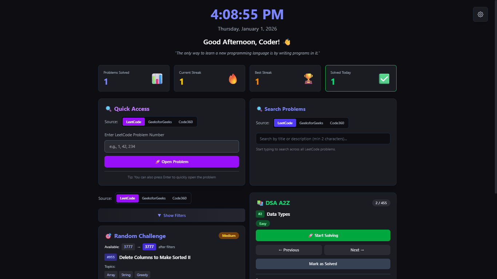
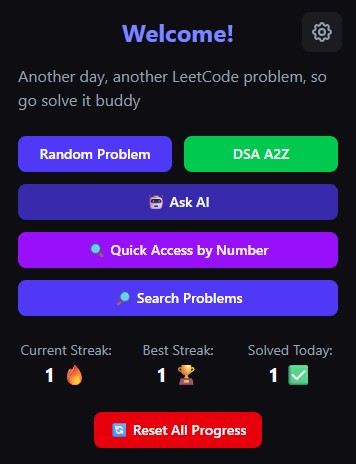
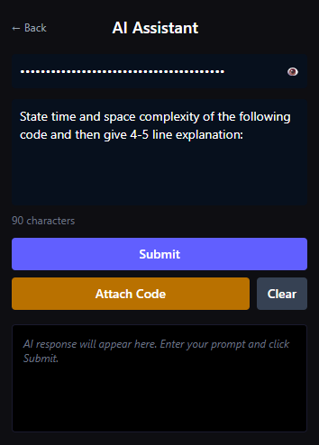
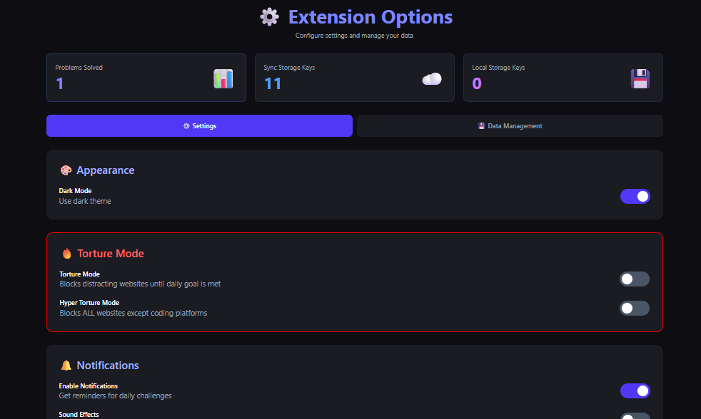

# 🚀 TUFDsa - DSA Practice Companion

<div align="center">


**Your Personal DSA Practice Tracker & Problem Recommendation Engine**

[](https://chrome.google.com/webstore)
[](https://developer.chrome.com/docs/extensions/mv3/)
[](https://reactjs.org/)
[](https://vitejs.dev/)
[](https://tailwindcss.com/)
[](LICENSE)

</div>

---

## 📋 Table of Contents

- [Overview](#overview)
- [Key Features](#key-features)
- [Screenshots](#screenshots)
- [Tech Stack](#tech-stack)
- [Architecture](#high-level-architecture)
- [Installation & Setup / Build](#installation-setup)
- [Folder Structure](#folder-structure)
- [NPM Scripts](#npm-yarn-scripts)
- [Environment Variables](#environment-variables)
- [Common Issues / FAQ](#common-issues-faq)
- [Contributing](#contributing)
- [License](#license)

---

## 🌟 Overview <a id="overview"></a>

**TUFDsa** is a feature-rich Chrome Extension designed for developers and students who want to systematically improve their **Data Structures and Algorithms (DSA)** skills.

### The Problem It Solves

- 🎯 **Decision Fatigue**: No more wondering "which problem should I solve today?"
- 📊 **Scattered Progress**: Track all your solved problems across multiple platforms in one place
- 🔥 **Motivation Loss**: Streak system keeps you accountable with daily practice goals
- 🧠 **Context Switching**: Get AI-powered hints without leaving your coding environment

### Who Is This For?

- 💼 **Job Seekers** preparing for technical interviews
- 🎓 **Students** learning DSA fundamentals
- 👨‍💻 **Developers** wanting to stay sharp with daily practice
- 🏆 **Competitive Programmers** tracking their progress

---

## ✨ Key Features <a id="key-features"></a>

| Feature                          | Description                                                                                               |
| -------------------------------- | --------------------------------------------------------------------------------------------------------- |
| 🎲 **Random Problem Generator**  | Get a random problem based on difficulty, topics, or company tags                                         |
| 📚 **A2Z DSA Sheet Integration** | Follow the popular TakeUForward A2Z DSA course systematically                                             |
| 🔥 **Streak System**             | Calendar-based streak tracking with "at-risk" warnings                                                    |
| 🔍 **Multi-Platform Search**     | Search problems from LeetCode, GeeksforGeeks, and Code360                                                 |
| 🤖 **AI Assistant**              | Ask AI for hints, complexity analysis, and explanations                                                   |
| 🌙 **New Tab Override**          | Replace Chrome's new tab with your DSA dashboard                                                          |
| ⚡ **Quick Access**              | Open problems with id for quick access across **3000+ problem** from LeetCode, GeeksforGeeks, and Code360 |
| 🎚️ **Advanced Filters**          | Filter by difficulty, topics, company, and solved status                                                  |
| 😈 **Torture Mode**              | Hardcore mode that disables skipping problems                                                             |
| 📊 **Statistics Dashboard**      | Track total solved, daily progress, and streak history                                                    |

---

## 📸 Screenshots <a id="screenshots"></a>

### New Tab Dashboard



### Popup Interface



### AI Assistant



### Options Page



---

## 🛠️ Tech Stack <a id="tech-stack"></a>

### Core Technologies

| Technology             | Version    | Purpose                          |
| ---------------------- | ---------- | -------------------------------- |
| **React**              | 18.2.x     | UI Components & State Management |
| **Vite**               | 7.x        | Build Tool & Dev Server          |
| **@crxjs/vite-plugin** | 2.0.0-beta | Chrome Extension Integration     |
| **Tailwind CSS**       | 4.x        | Utility-First Styling            |

### Key Dependencies

| Package          | Purpose                                      |
| ---------------- | -------------------------------------------- |
| `react-markdown` | Render AI responses with Markdown formatting |
| `axios`          | HTTP client (used in scrapers)               |
| `puppeteer`      | Web scraping for problem data updates        |

### Development Tools

| Tool                | Purpose               |
| ------------------- | --------------------- |
| `prettier`          | Code formatting       |
| `gulp` + `gulp-zip` | Extension packaging   |
| `glob`              | File pattern matching |

---

## 🏗️ High Level Architecture <a id="high-level-architecture"></a>

```
┌──────────────────────────────────────────────────────────────────────────────┐
│                            CHROME BROWSER                                    │
├──────────────────────────────────────────────────────────────────────────────┤
│                                                                              │
│   ┌──────────────────────────────────────────────────────────────────────┐   │
│   │                       TUFdsa EXTENSION                               │   │
│   │                                                                      │   │
│   │  ┌─────────────┐  ┌─────────────┐  ┌─────────────┐  ┌────────────┐   │   │
│   │  │   POPUP     │  │   NEWTAB    │  │   OPTIONS   │  │ SIDEPANEL  │   │   │
│   │  │   popup/    │  │   newtab/   │  │   options/  │  │ sidepanel/ │   │   │
│   │  │             │  │             │  │             │  │            │   │   │
│   │  │  ┌───────┐  │  │  ┌───────┐  │  │  ┌───────┐  │  │ ┌───────┐  │   │   │
│   │  │  │ React │  │  │  │ React │  │  │  │ React │  │  │ │ React │  │   │   │
│   │  │  │  App  │  │  │  │  App  │  │  │  │  App  │  │  │ │  App  │  │   │   │
│   │  │  └───┬───┘  │  │  └───┬───┘  │  │  └───┬───┘  │  │ └───┬───┘  │   │   │
│   │  └──────┼──────┘  └──────┼──────┘  └──────┼──────┘  └─────┼──────┘   │   │
│   │         │                │                │               │          │   │
│   │         └────────────────┴──────┼─────────┴───────────────┘          │   │
│   │                                 │                                    │   │
│   │                                 ▼                                    │   │
│   │  ┌─────────────────────────────────────────────────────────────────┐ │   │
│   │  │                    CHROME STORAGE API                           │ │   │
│   │  │                                                                 │ │   │
│   │  │  ┌──────────────────┐        ┌──────────────────────────────┐   │ │   │
│   │  │  │   sync storage   │        │        local storage         │   │ │   │
│   │  │  │                  │        │                              │   │ │   │
│   │  │  │ • solveHistory   │        │ • (currently unused)         │   │ │   │
│   │  │  │ • userSettings   │        │                              │   │ │   │
│   │  │  │ • currentProblem │        │                              │   │ │   │
│   │  │  │ • savedFilters   │        │                              │   │ │   │
│   │  │  └──────────────────┘        └──────────────────────────────┘   │ │   │
│   │  └─────────────────────────────────────────────────────────────────┘ │   │
│   │                          │                                           │   │
│   │                          │ chrome.storage.onChanged                  │   │
│   │                          ▼                                           │   │
│   │  ┌─────────────────────────────────────────────────────────────────┐ │   │
│   │  │                 SERVICE WORKER (background/)                    │ │   │
│   │  │                                                                 │ │   │
│   │  │  • chrome.runtime.onMessage listener                            │ │   │
│   │  │  • Event-driven lifecycle                                       │ │   │
│   │  │  • Minimal code (offloads to UI contexts)                       │ │   │
│   │  └─────────────────────────────────────────────────────────────────┘ │   │
│   │                                                                      │   │
│   └──────────────────────────────────────────────────────────────────────┘   │
│                                                                              │
│   ┌──────────────────────────────────────────────────────────────────────┐   │
│   │                         WEB PAGE CONTEXT                             │   │
│   │                                                                      │   │
│   │  ┌───────────────────────────────────────────────────────────────┐   │   │
│   │  │                     CONTENT SCRIPTS                           │   │   │
│   │  │                                                               │   │   │
│   │  │  contentScript/index.js      contentScript/askAiHelper.js     │   │   │
│   │  │  • Runs on all HTTP(S)       • Runs on LeetCode/GFG/Code360   │   │   │
│   │  │  • Generic injection         • Extracts user code             │   │   │
│   │  │                                (With custom userscript)       │   │   │
│   │  └───────────────────────────────────────────────────────────────┘   │   │
│   │                                                                      │   │
│   └──────────────────────────────────────────────────────────────────────┘   │
│                                                                              │
└──────────────────────────────────────────────────────────────────────────────┘
```

### Key Data Entities

```
┌──────────────────────────────────────────────────────────────────┐
│                       DATA ENTITIES                              │
├──────────────────────────────────────────────────────────────────┤
│                                                                  │
│  ┌──────────────────────────────────────────────────────────┐    │
│  │  SOLVE HISTORY (Source of Truth)                         │    │
│  │                                                          │    │
│  │  {                                                       │    │
│  │    "randomSolveHistory": {                               │    │
│  │      "[problemId]": 1704067200000  // timestamp          │    │
│  │    },                                                    │    │
│  │    "a2zSolveHistory": {                                  │    │
│  │      "[problemId]": 1704153600000                        │    │
│  │    }                                                     │    │
│  │  }                                                       │    │
│  └──────────────────────────────────────────────────────────┘    │
│                                                                  │
│  ┌──────────────────────────────────────────────────────────┐    │
│  │  USER SETTINGS                                           │    │
│  │                                                          │    │
│  │  {                                                       │    │
│  │    darkMode: true,                                       │    │
│  │    tortureMode: false,                                   │    │
│  │    hyperTortureMode: false,                              │    │
│  │    dailyGoal: 1,                                         │    │
│  │    showDifficulty: true,                                 │    │
│  │    showTopics: true,                                     │    │
│  │    ...                                                   │    │
│  │  }                                                       │    │
│  └──────────────────────────────────────────────────────────┘    │
│                                                                  │
│  ┌──────────────────────────────────────────────────────────┐    │
│  │  CURRENT PROBLEM STATE                                   │    │
│  │                                                          │    │
│  │  {                                                       │    │
│  │    "currentRandomProblem": { ...problemObject },         │    │
│  │    "lastA2zIndex": 42,                                   │    │
│  │    "randomProblemDataSource": "leetcode" | "gfg" | ...   │    │
│  │  }                                                       │    │
│  └──────────────────────────────────────────────────────────┘    │
│                                                                  │
└──────────────────────────────────────────────────────────────────┘
```

### Component Breakdown

| Component           | File                           | Purpose                              |
| ------------------- | ------------------------------ | ------------------------------------ |
| **Popup**           | `src/popup/popup.html`         | Quick access toolbar popup           |
| **New Tab**         | `src/newtab/newtab.html`       | Dashboard replacing Chrome's new tab |
| **Options**         | `src/options/options.html`     | Settings and data management         |
| **Side Panel**      | `src/sidepanel/sidepanel.html` | Chrome side panel integration        |
| **DevTools**        | `src/devtools/devtools.html`   | Developer tools panel                |
| **Service Worker**  | `src/background/index.js`      | Dummy not used now                   |
| **Content Scripts** | `src/contentScript/`           | DOM interaction on coding platforms  |

### Message Passing Flow

```
User clicks "Ask AI" with code
         │
         ▼
┌─────────────────┐    chrome.tabs.sendMessage      ┌─────────────────┐
│   Popup/UI      │ ─────────────────────────────▶  │ Content Script  │
│                 │                                 │                 │
│                 │ ◀─────────────────────────────  │ Extracts code   │
└─────────────────┘    { type: "USER_CODE", ... }   └─────────────────┘
         │
         ▼
   Sends to Cohere API
         │
         ▼
   Displays AI Response
```

---

## 🚀 Installation & Setup / Build <a id="installation-setup"></a>

### Prerequisites

- **Node.js** >= 14.18.0
- **npm** or **yarn**
- **Google Chrome** (latest recommended)

### 1. Clone the Repository

```bash
git clone https://github.com/JitishxD/TUFDsa.git
cd TUFDsa
```

### 2. Install Dependencies

```bash
npm install
# or
yarn install
```

### 3. Development Mode

Start the development server with hot reload:

```bash
npm run dev
# or
yarn dev
```

1. Vite starts dev server
2. CRXJS plugin watches for changes
3. Extension auto-reloads in Chrome

### 4. Load Unpacked Extension in Chrome

1. Open Chrome and navigate to `chrome://extensions/`
2. Enable **Developer mode** (toggle in top-right)
3. Click **Load unpacked**
4. Select the `build/` folder from this project

> **Note**: During development, the extension will auto-reload when you make changes. You may need to refresh the extension or reload pages for content script changes.

### 5. Production Build

```bash
npm run build
# or
yarn build
```

1. Vite builds optimized bundles
2. CRXJS generates final `manifest.json`
3. Assets are hashed for caching
4. Output goes to an optimized production build in the `build/` directory.

### 6. Package for Distribution

```bash
npm run zip
```

1. Runs production build
2. Gulp zips the `build/` folder
3. Creates `TUFDsa-{version}.zip` in `package/`

---

## 📁 Folder Structure <a id="folder-structure"></a>

```
TUFDsa/
├── 📄 package.json           # Dependencies and scripts
├── 📄 vite.config.js         # Vite + CRXJS configuration
├── 📄 vitest.config.js       # Vitest config file
├── 📄 jsconfig.json          # TypeScript/JS configuration
│
├── 📂 src/                   # Source code
│   ├── 📄 manifest.js        # Dynamic manifest generation
│   ├── 📄 zip.js             # Gulp-based packaging script
│   │
│   ├── 📂 background/        # Service worker
│   │   └── 📄 index.js       # Message listeners, events
│   │
│   ├── 📂 contentScript/     # Content scripts
│   │   ├── 📄 index.js       # Generic content script
│   │   └── 📄 askAiHelper.js # Code extraction for AI
│   │
│   ├── 📂 popup/             # Popup UI
│   │   ├── 📄 popup.html     # HTML entry point (manifest: src/popup/popup.html)
│   │   ├── 📄 index.jsx      # Entry point
│   │   ├── 📄 PopUpHome.jsx  # Main popup component
│   │   ├── 📄 aiIntegration.js # Cohere AI integration
│   │   ├── 📂 Components/    # Popup components
│   │   └── 📂 Styles/        # Popup styles
│   │
│   ├── 📂 newtab/            # New Tab UI
│   │   ├── 📄 newtab.html    # HTML entry point (manifest: src/newtab/newtab.html)
│   │   ├── 📄 index.jsx      # Entry point
│   │   ├── 📄 NewTab.jsx     # Dashboard component
│   │   ├── 📂 Components/    # Dashboard components
│   │   └── 📂 Styles/        # Dashboard styles
│   │
│   ├── 📂 options/           # Options Page
│   │   ├── 📄 options.html   # HTML entry point (manifest: src/options/options.html)
│   │   ├── 📄 index.jsx      # Entry point
│   │   ├── 📄 Options.jsx    # Settings component
│   │   ├── 📂 Components/    # Options components
│   │   └── 📂 Styles/        # Options styles
│   │
│   ├── 📂 sidepanel/         # Chrome Side Panel
│   │   ├── 📄 sidepanel.html # HTML entry point (manifest: src/sidepanel/sidepanel.html)
│   │   └── 📄 SidePanel.jsx  # Side panel component
│   │
│   ├── 📂 devtools/          # Chrome DevTools Panel
│   │   ├── 📄 devtools.html  # HTML entry point (manifest: src/devtools/devtools.html)
│   │   └── 📄 DevTools.jsx   # DevTools component
│   │
│   ├── 📂 problem-data/      # Problem datasets (JSON)
│   │   ├── 📄 DSAa2zProblems.json
│   │   ├── 📄 leetCodeAllProblemDump.json
│   │   ├── 📄 gfg_problems.json
│   │   └── 📄 code360_problems_indexed.json
│   │
│   ├── 📂 utils/             # Shared utilities
│   │   ├── 📄 statsTracker.js    # Streak & stats logic
│   │   ├── 📄 problemFilters.js  # Filter utilities
│   │   ├── 📄 useRandomProblem.js # Shared hook
│   │   └── 📄 uiHelpers.js       # UI utilities
│   │
│   └── 📂 assets/            # Static assets
│
├── 📂 public/                # Public assets
│   ├── 📂 icons/             # Extension icons
│   └── 📂 img/               # Images (logo, etc.)
│
└── 📂 Scrapper/              # Problem data scrapers
    ├── 📂 leetCodeScrape/    # LeetCode scraping
    ├── 📂 geeksforgeeks/     # GFG scraping
    ├── 📂 code360/           # Code360 scraping
    └── 📂 TUFScrape/         # TakeUForward scraping
```

---

## 📜 NPM / Yarn Scripts <a id="npm-yarn-scripts"></a>

| Script      | Command           | Description                      |
| ----------- | ----------------- | -------------------------------- |
| **dev**     | `npm run dev`     | Start Vite dev server with HMR   |
| **build**   | `npm run build`   | Production build to `build/`     |
| **preview** | `npm run preview` | Preview production build         |
| **fmt**     | `npm run fmt`     | Format code with Prettier        |
| **zip**     | `npm run zip`     | Build + create distributable ZIP |

---

## 🔐 Environment Variables <a id="environment-variables"></a>

The extension currently doesn't require environment variables for basic functionality.

### Optional Configuration

| Variable | Purpose                  | Where Used                |
| -------- | ------------------------ | ------------------------- |
| API Keys | Stored in Chrome Storage | Options page / AI feature |

> **Note**: For security, API keys (like Cohere API key for AI features) are stored in Chrome's sync storage rather than environment variables.

---

## ❓ Common Issues / FAQ <a id="common-issues-faq"></a>

### 🔴 Extension Not Loading

**Problem**: "Load unpacked" shows errors

**Solution**:

1. Ensure you ran `npm run build` first
2. Select the `build/` folder, not the project root
3. Check for manifest syntax errors

### 🔴 Hot Reload Not Working

**Problem**: Changes don't reflect in the extension

**Solution**:

1. For popup/newtab: Close and reopen the popup/tab
2. For content scripts: Refresh the target page
3. For background: Reload the extension from `chrome://extensions/`

### 🔴 Content Script Not Injecting

**Problem**: "Could not reach content script" error

**Solution**:

1. Refresh the target page after loading the extension
2. Check if the URL matches patterns in `manifest.js`
3. Verify permissions in manifest

### 🔴 AI Feature Not Working

**Problem**: "Permission denied" or API errors

**Solution**:

1. Grant the `https://api.cohere.ai/*` permission when prompted
2. Verify your API key is correct
3. Check network connectivity

### 🔴 Storage Quota Exceeded

**Problem**: Solve history not saving

**Solution**:

1. Clear old data from Options page
2. Use the "Data Management" tab to export/backup
3. Consider resetting progress if history is too large

### 🔴 CORS Errors

**Problem**: API requests blocked

**Solution**:

- Ensure origin permissions are in manifest
- Use background script for cross-origin requests

---

## 🤝 Contributing <a id="contributing"></a>

We welcome contributions! Here's how to get started:

### Branching Strategy

| Branch      | Purpose               |
| ----------- | --------------------- |
| `main`      | Production-ready code |
| `develop`   | Integration branch    |
| `feature/*` | New features          |
| `fix/*`     | Bug fixes             |
| `docs/*`    | Documentation updates |


### Testing

The tests are in [src/utils/streakCalculator.test.js](src/utils/streakCalculator.test.js) and imports the implementation from `statsTracker.js`.

```bash
npm run test
```

### Commit Conventions

Follow [Conventional Commits](https://www.conventionalcommits.org/):

```
feat: add new filter option for company tags
fix: resolve streak calculation bug
docs: update README with new screenshots
refactor: simplify useRandomProblem hook
```

### Code Style

- **Formatting**: Run `npm run fmt` before committing
- **Components**: Use functional components with hooks
- **Naming**:
  - Components: `PascalCase`
  - Utilities: `camelCase`
  - CSS classes: Use Tailwind utilities

### Pull Request Process

1. Fork the repository
2. Create a feature branch
3. Make your changes
4. Run `npm run fmt`
5. Submit a PR with a clear description

---

## 📄 License <a id="license"></a>

This project is licensed under the **MIT License** - see the [LICENSE](LICENSE) file for details.

---

## 🙏 Acknowledgements

- [TakeUForward](https://takeuforward.org/) for the A2Z DSA sheet
- [LeetCode](https://leetcode.com/), [GeeksforGeeks](https://www.geeksforgeeks.org/), [Code360](https://www.naukri.com/code360) for problem data
- [CRXJS](https://crxjs.dev/) for the amazing Vite plugin
- [Cohere](https://cohere.ai/) for AI API

---

<div align="center">

**Made with ❤️ for the DSA community**

[Report Bug](https://github.com/JitishxD/TUFDsa/issues) · [Request Feature](https://github.com/JitishxD/TUFDsa/issues)

</div>
